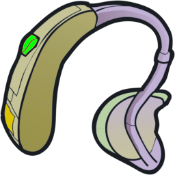

# Hearing Aid



Battery-powered hearing aids for Project Zomboid. Wear a working aid and switch it on, and a Hard of Hearing character hears normally while a Deaf one hears a little. A boosted aid gives Keen Hearing to anyone who isn't Deaf.

**Status**: Requires Build 42.21 or newer. Tested in single player on 42.21.0. Multiplayer is untested: the server owns battery drain and hearing traits, and the mod loads on a dedicated server, but nobody has played it with clients connected.

## Install

Subscribe on the [Steam Workshop page](https://steamcommunity.com/sharedfiles/filedetails/?id=2931424725) and enable **Hearing Aid** in the mod list. Build 41 loads the original release, which this repository keeps unchanged in `Contents/mods/HearingAid/media`.

## How it works

To hear better, you need a working aid with a charged battery, on your ear and switched on:

1. Find a working aid, or find a broken one and [repair it](#crafting).
2. Right-click the aid and choose **Add Battery**. It takes the same Battery as a flashlight, and the menu lists yours by charge.
3. Wear the aid, right-click it, and choose **Turn On**.

The battery drains only while the aid is worn and switched on, so switch it off when you don't need it. The tooltip shows the charge and whether the aid is on. Take the aid off, switch it off, or let the battery run flat, and you hear as you did before. **Remove Battery** gives the battery back with whatever charge it has left.

| Aid | Hard of Hearing becomes | Deaf becomes | A battery lasts |
|---|---|---|---|
| Hearing Aid | Normal hearing | Hard of Hearing | 2 days |
| Efficient Hearing Aid | Normal hearing | Hard of Hearing | 6 days |
| Boosted Hearing Aid | Keen Hearing | Normal hearing | 4 days |

A boosted aid also gives Keen Hearing to a character whose hearing is normal. A Broken Hearing Aid does nothing until you repair it.

### Finding one

Most hearing aids in Knox County are still in their owners' ears, and the owners won't mind if you take them. About 1 in 65 zombies carries one. So do 1 in 10 zombies dressed as retirees, who crowd nursing homes, trailer parks, golf courses, and rich neighborhoods, and 1 in 20 hospital patients. These rates follow a [1994 US survey](https://ftp.cdc.gov/pub/Health_Statistics/NCHS/Publications/DVD/DVD_1/Advance_Data/ad292.pdf) in which 1 in 60 Americans used a hearing aid, and 1 in 10 of those over 65.

Off the ear, search nightstands and bathroom cabinets first, then dressers, living room side tables, boxes of old electronics, hospital bedside tables, waiting room desks, lost and found boxes, and doctors' desks. Pharmacies, optical stores, and electronics stores didn't sell hearing aids in 1993, so they have none.

Four in five aids you find are broken, and only about 1 in 150 is efficient. Half the working ones still hold a partly used battery. Hearing aids count as Medical loot, so the Medical loot rarity setting scales them too.

### Crafting

Repairs and upgrades are fiddly work. You need a table or counter within reach, enough light to see by, a screwdriver, tweezers, and reading glasses or a magnifier (a Loupe or a Magnifying Glass). You can wear the glasses while you work, but the aid has to come off your ear. The new aid keeps the old one's battery, and stays switched on if it was on.

| Recipe | Electrical | Makes | Uses up |
|---|---|---|---|
| Repair Hearing Aid | 2 | Hearing Aid from a Broken Hearing Aid | Earbuds, 1 use of Alcohol Wipes or Cotton Balls Doused in Alcohol, 1 use of Glue |
| Optimize Hearing Aid | 4 | Efficient Hearing Aid from a Hearing Aid | a Digital Watch, Electrical Wire, 1 use of Glue |
| Boost Hearing Aid | 8 | Boosted Hearing Aid from an Efficient Hearing Aid | Amplifier, Microphone, 2 Electrical Wire, 1 use of Epoxy |

Boosting also needs a Scalpel, which you keep.

The parts make sense if you squint: the earbuds give up their tiny speaker, the alcohol cleans the corroded battery contacts, and the watch donates its low-power chip. Everything a repair needs turns up in ordinary houses. A boost takes more hunting: dismantle a Speaker for its Amplifier, and look for a Microphone in music stores, band practice rooms, and electronics stores.

**Dismantle Hearing Aid** needs only a screwdriver and no table. It turns any aid into Scrap Electronics and gives its battery back.

### Sandbox options

The **Hearing Aid** page of the sandbox options sets the battery life of each tier, the Electrical level each recipe needs, separate loot multipliers for broken and working aids, the chance that a found aid holds a battery, how aids help Deaf characters, and whether boosted aids can be crafted. Everything above describes the defaults.

## Development

Clone the repository to `~/Zomboid/Workshop/HearingAid`. With Steam running, the game lists Workshop staging folders as local mods. Unsubscribe from the Workshop copy while you develop, because two copies with the same mod id conflict. The scripts assume the macOS Steam install; set `PZ_APP` to the game's `Contents` folder if yours differs.

```sh
dev/validate-server.sh           # boots a headless dedicated server; fails if the mod logs an error
dev/run-debug-client.sh --test   # runs every in-game test; click "Click to start" once
```

Read [DEVELOPMENT.md](DEVELOPMENT.md) for the testing tools, the Build 42 behavior this mod depends on, and the release checklist.
