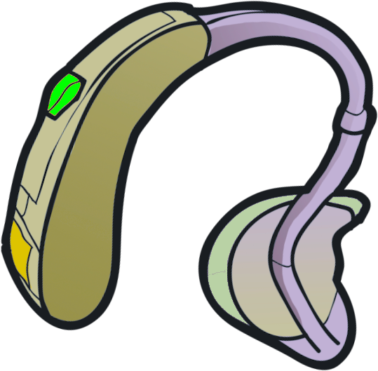

# Hearing Aid



Battery-powered hearing aids for Project Zomboid. Deaf and Hard of Hearing survivors can work their way back to better hearing.

Steam Workshop: [2931424725](https://steamcommunity.com/sharedfiles/filedetails/?id=2931424725). Requires Build 42.21 or newer (`versionMin=42.21`); tested in single player on 42.21.0, the current stable build. Multiplayer is built the B42 way (the server owns battery drain and traits) but hasn't been run on a live server yet. The Build 41 version under `Contents/mods/HearingAid/media` is the published B41 release and is left as is.

## Gameplay

| Item | How you get it | Effect while worn, on and charged | Battery life (default) |
|---|---|---|---|
| Broken Hearing Aid | Common loot | None | — |
| Hearing Aid | Rare loot, or repair a broken one | Hard of Hearing → normal; Deaf → Hard of Hearing | 48 h |
| Efficient Hearing Aid | Very rare loot, or optimize a hearing aid | Same as Hearing Aid | 144 h |
| Boosted Hearing Aid | Crafted from an efficient one | Hard of Hearing / normal → Keen Hearing; Deaf → normal | 96 h |

- Right-click a working hearing aid to **Add Battery** (any charged `Base.Battery`), **Remove Battery**, **Turn on** / **Turn off**.
- It only drains while worn and switched on. Taking it off, switching it off or a dead battery restores your own hearing trait.
- The tooltip shows battery charge and whether it is on.
- Found aids have a chance to still hold a used battery.
- It goes in its own body slot, so it doesn't replace earrings.

### Crafting (Electrical)

| Recipe | Needs | Skill |
|---|---|---|
| Repair Hearing Aid | Broken aid, 2 electronics scrap, screwdriver | Electrical 2 |
| Optimize Hearing Aid | Hearing aid, 2 electronics scrap, aluminum, screwdriver | Electrical 4 |
| Boost Hearing Aid | Efficient aid, 4 electronics scrap, earbuds, amplifier, electric wire, screwdriver, scalpel | Electrical 8 |
| Dismantle Hearing Aid | Any hearing aid, screwdriver | — |

Upgrades keep the battery and on/off state. Dismantling returns the battery.

### Loot

Bathroom cabinets, nightstands, dressers, living room side tables, kitchen junk drawers, home office desks, electronics crates, bathroom bins (broken only), hospital wardrobes, medical office desks, clinic counters, pharmacy and optometrist displays, electronics stores. Corpses: all zombies (rare), retirees, hospital patients, bathrobes (more likely). Hearing aids count as Medical loot for the sandbox loot rarity settings.

### Sandbox options (page "Hearing Aid")

| Option | Default |
|---|---|
| Battery Life: Hearing Aid / Efficient / Boosted (in-game hours on one full battery) | 48 / 144 / 96 |
| Found With Battery Chance (%) | 50 |
| Broken Hearing Aid Loot, Working Hearing Aid Loot (multipliers, 0 disables) | 1.0 |
| Handle Deafness | Hearing aids give hard of hearing, boosted give normal hearing |
| Enable Boosted Hearing Aids | On |

## Layout

```
Contents/mods/HearingAid/
  common/media/          models (FBX), icons, worn/ground textures
  42/mod.info
  42/media/registries.lua                     registers body location hearingaid:hearingaid
  42/media/scripts/                           items, ground models, craftRecipes
  42/media/clothing/ + fileGuidTable.xml      worn models
  42/media/sandbox-options.txt
  42/media/lua/shared/HearingAid/HearingAid.lua            state, trait rules, battery drain
  42/media/lua/shared/TimedActions/HearingAidAction.lua    battery / on / off action
  42/media/lua/server/                        periodic drain, loot tables
  42/media/lua/client/HearingAid/             right-click menu, tooltip, debug scenario + tests
  42/media/lua/shared/Translate/EN/*.json
  media/, mod.info                            Build 41 release (untouched)
dev/                                          test tooling, not uploaded
```

State lives in item modData (`HearingAid_charge`, `HearingAid_on`). The hearing trait the character had before the aid changed it is kept in player modData. In multiplayer the server owns drain and traits; the timed action's `complete()` runs on the server.

## Development

Read [DEVELOPMENT.md](DEVELOPMENT.md) first. It covers the B42 modding rules this mod depends on, how to decompile the game for ground truth, and the testing gotchas.

This folder is a Workshop staging item, so with Steam running the game lists it from `~/Zomboid/Workshop/HearingAid`. Don't also subscribe to the Workshop copy while developing (duplicate mod id).

All testing uses the game's own debug tooling.

**Headless check** (dedicated server, no Steam, throwaway cache dir). Loads registries, scripts, sandbox options, shared and server Lua, and the loot hook, then shuts down:

```sh
dev/validate-server.sh
```

**Debug client.** Separate cache dir with only this mod enabled; your settings are copied, your saves are not touched:

```sh
dev/run-debug-client.sh          # main menu → SCENARIOS → "Hearing Aid"
dev/run-debug-client.sh --auto   # also loads dev/HearingAidDevHarness
```

- The **Hearing Aid** debug scenario starts a zombie-free world with a Hard of Hearing character, Electrical 8, every tier, batteries and crafting materials. It's in the mod and shows up whenever the game runs with `-debug`.
- **Unit tests** are registered with the vanilla runner: bug icon (left sidebar) → Dev → Unit Tests → Timed Actions → `hearingaid_*` → Run. They cover battery insert and remove, on/off, every trait/tier/deafness-mode combination, taking the aid off, battery drain and death, and every recipe through the real right-click craft path.
- `--auto` launches the scenario on its own. After you click "Click to start" once, it runs every `hearingaid_*` test, checks scripts, registries, loot tables, translations and the right-click menu, and saves screenshots to `<cache>/Screenshots`. Results go to `<cache>/console.txt`:

```sh
grep -E "HearingAid(Test|Check)" "${TMPDIR:-/tmp}/pz-hearingaid-client/console.txt"
```

You can also launch your normal game with `-debug` in Steam's launch options. The scenario and tests are there too.
