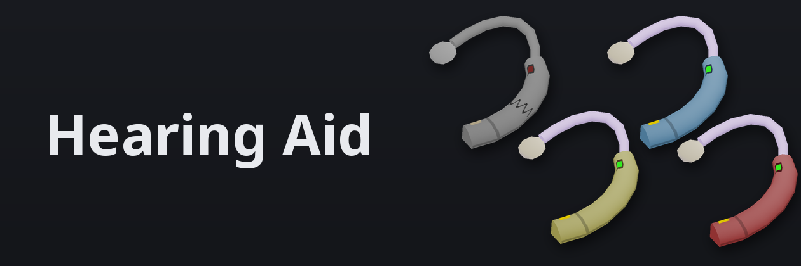
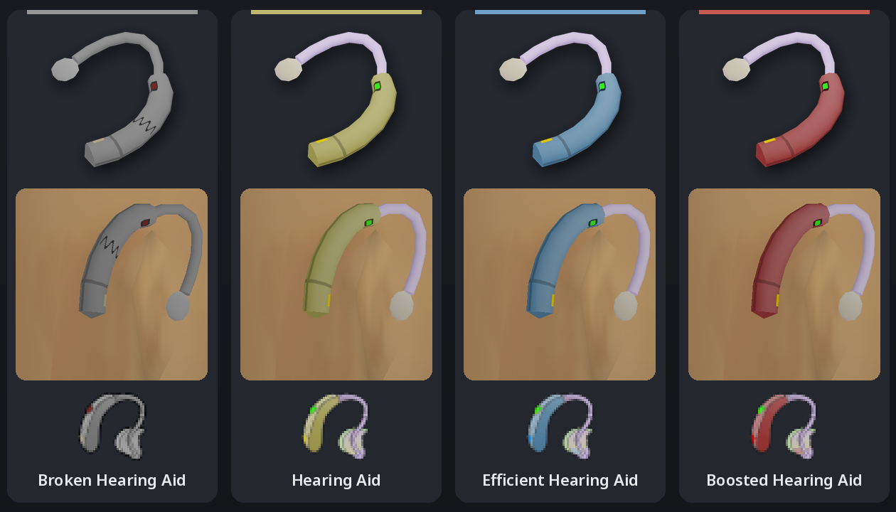
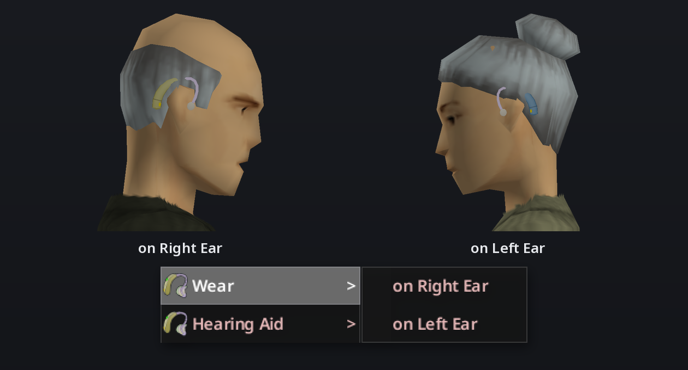
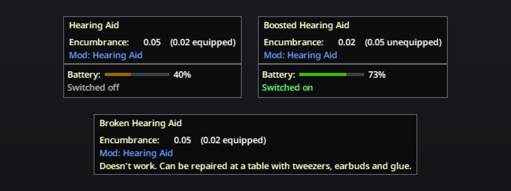
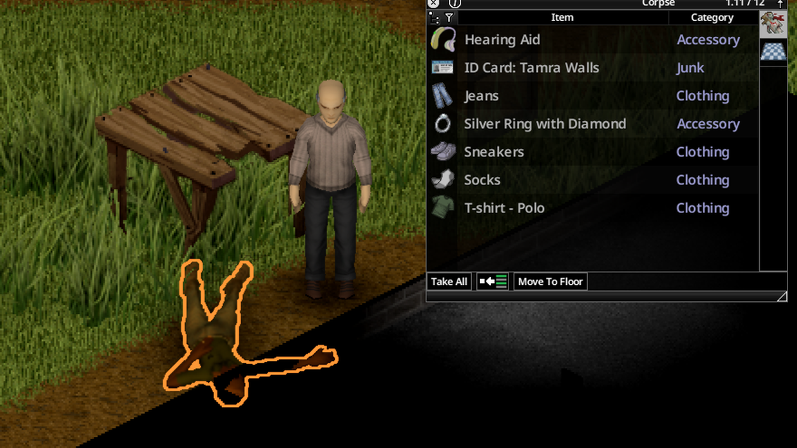
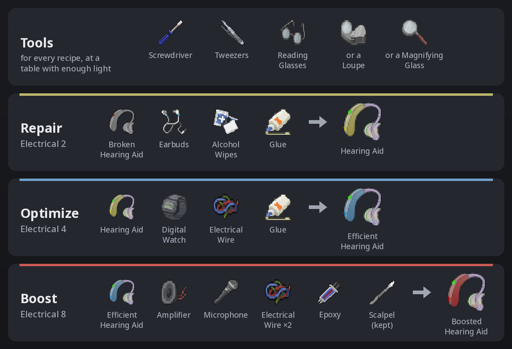

# 

Take Deaf or Hard of Hearing and work your way out of it. Most hearing aids you find are broken. Repair one, and a Hard of Hearing character hears normally. Upgrade it twice, and a Deaf character hears normally too, while anyone else gets Keen Hearing. Working hearing aids run on batteries.

**Status**: Requires Build 42.21 or newer. Tested in single player on 42.21.0. Multiplayer is untested: the server owns battery drain and hearing traits, and the mod loads on a dedicated server, but nobody has played it with clients connected.

## Install

Subscribe on the [Steam Workshop page](https://steamcommunity.com/sharedfiles/filedetails/?id=2931424725) and enable **Hearing Aid** in the mod list. Build 41 loads the original release, which this repository keeps unchanged in `Contents/mods/HearingAid/media`.

## Hearing aid models

| Model | Hard of Hearing becomes | Deaf becomes | A battery lasts | How you get one |
|---|---|---|---|---|
| Broken Hearing Aid | no change | no change | | Most hearing aids you find are broken |
| Hearing Aid | Normal hearing | Hard of Hearing | 2 days | Find one, or repair a broken one |
| Efficient Hearing Aid | Normal hearing | Hard of Hearing | 6 days | A lucky find, or optimize a hearing aid |
| Boosted Hearing Aid | Keen Hearing | Normal hearing | 4 days | Boost an Efficient Hearing Aid |

A Boosted Hearing Aid also gives Keen Hearing to a character whose hearing is normal.

## Wearing one

To hear better, you need a working hearing aid with a charged battery, on your ear and switched on:

1. Find a working hearing aid, or find a broken one and [repair it](#crafting).
2. Right-click it and choose **Add Battery**. It takes the same Battery as a flashlight, and the menu lists yours by charge.
3. Right-click it, choose **Wear**, and pick **on Right Ear** or **on Left Ear**. Then right-click it again and choose **Turn On**. The same menu moves it to your other ear.

The battery drains only while the hearing aid is worn and switched on, so switch it off when you don't need to hear. The tooltip shows the charge and whether it's on. Take it off, switch it off, or let the battery run flat, and you hear as you did before. **Remove Battery** gives the battery back with whatever charge it has left.

## Finding one

Most hearing aids in Knox County are still in their owners' ears, and the owners won't mind if you take them, so search the dead first. Zombies dressed as retirees carry them far more often than anyone else, and they gather in nursing homes, trailer parks, golf courses, country clubs, and rich neighborhoods. Hospital patients come next, in their gowns and bathrobes. Any other zombie might have one too.

Off the ear, hospitals hold the most: the wardrobes beside patients' beds, doctors' desks, which hold only working ones, and waiting room desks. Lost and found boxes hold some too. In houses, look in bedside tables, dressers, living room side tables, bathroom cabinets and counters, and boxes of old electronics. Pharmacies, optical stores, and electronics stores didn't sell hearing aids in 1993, so they have none.

Most hearing aids you find are broken, and efficient ones are rare. Half the working ones still hold a partly used battery. Hearing aids count as Medical loot, so the Medical loot rarity setting scales them too.

## Crafting

Repairs and upgrades need a table or counter within reach, enough light to see by, a screwdriver, tweezers, and reading glasses or a magnifier (a Loupe or a Magnifying Glass). You can wear the glasses while you work, but the hearing aid has to come off your ear. The new hearing aid keeps the old one's battery, and stays switched on if the old one was on.

| Recipe | Electrical | Makes | Uses up |
|---|---|---|---|
| Repair Hearing Aid | 2 | Hearing Aid from a Broken Hearing Aid | Earbuds, 1 use of Alcohol Wipes or Cotton Balls Doused in Alcohol, 1 use of Glue |
| Optimize Hearing Aid | 4 | Efficient Hearing Aid from a Hearing Aid | a Digital Watch, Electrical Wire, 1 use of Glue |
| Boost Hearing Aid | 8 | Boosted Hearing Aid from an Efficient Hearing Aid | Amplifier, Microphone, 2 Electrical Wire, 1 use of Epoxy |

Boosting also needs a Scalpel, which you keep.

The earbuds supply a new speaker, the alcohol cleans the corroded battery contacts, and the watch supplies a low-power chip. Everything a repair needs turns up in ordinary houses. For a boost, dismantle a Speaker for its Amplifier, and look for a Microphone in music stores, band practice rooms, and electronics stores.

**Dismantle Hearing Aid** needs only a screwdriver and no table. It turns any hearing aid into Scrap Electronics and gives its battery back.

## Sandbox options

The **Hearing Aid** page of the sandbox options holds:

- **Battery Life**: in-game hours a full battery lasts, for each working model.
- **Electrical Level**: the level each recipe needs. 0 removes the requirement.
- **Broken Hearing Aid Loot** and **Working Hearing Aid Loot**: multiply how often each spawns. 0 disables them.
- **Found With Battery Chance**: how often a working hearing aid you find still holds a battery.
- **Handle Deafness**: whether hearing aids help a Deaf character, and how much.
- **Enable Boosted Hearing Aids**: whether you can boost an Efficient Hearing Aid.

Everything above describes the defaults.

## Development

Clone the repository to `~/Zomboid/Workshop/HearingAid`. With Steam running, the game lists it as a local mod. Read [DEVELOPMENT.md](DEVELOPMENT.md) for the commands that test the mod and rebuild its art, and for the Build 42 behavior it depends on. Rebuilding the art needs [Blender](https://www.blender.org/) and [uv](https://docs.astral.sh/uv/).
